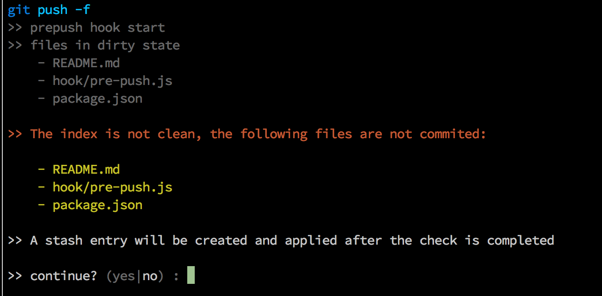

[](https://npmjs.org/package/prepush)
[](https://travis-ci.org/royriojas/prepush)

# prepush
> Yet another prepush module that will run tasks defined in a config file or in a package.json file, stashing anything that is not supposed to be pushed before run the scripts to avoid false positives

## Motivation

All the other modules similar to this one were specifying the prepush tasks in the `package.json` file. While this is ok
I needed to have it defined in a separated config file. Also I needed to have the option to interactively ask the user
to decide what to do in case a push was done with a dirty state (*uncommited*/*untracked* files)



## Install

```bash
# install it as a dev-dependency.
npm i --save-dev prepush

# install the hook, passing the path to the config. If none is provided it will try to use the `package.json`
./node_modules/prepush/bin/prepush.js install -c ./path/to/your/config
```

## protip

Using a custom prepush.json

```javascript
{
  "prepush" : [ "npm test" ]
}
```
or in your package.json file
```javascript
{
  "prepush" : [ "grunt prepush" ]
}
```

or as an object in a `custom.json` file or in `package.json`

```javascript
{
  "prepush" : {
    // the tasks to run
    "tasks" : [ "grunt prepush" ],
    // What to do in case of a dirty state
    // ask   => Show a prompt to the user to decide what to do, stash or fail.
    // fail  => Simply refuse to push something when you have uncommited/untracked files
    // stash => If there are uncommited/untracked files stash them, do the push and restore the stash
    //          This will also move untracked files into the stash
    "onDirtyState": "ask" // <== fail or stash
  }
}
```

**Important**
Be aware that if you cancel the program using `CTRL+C` then the stash might not be restored. So you will have
to restore it manually. TODO: trap the `SIGINT` event and restore the stash transparently for the user.

## Usage

```
Usage: prepush [install|remove] -c [path/to/config/file]

Options:
  -h, --help                 Show this help
  -c, --config path::String  path to a config JSON file with a prepush field in it. This file
                             is only required in case of install
  -v, --version              Outputs the version number
```

## Example

```bash
# install the hook and use the package.json prepush field
./node_modules/prepush/bin/prepush.js install

# install the hook using a custom prepush.json file
./node_modules/prepush/bin/prepush.js install -c ./path/to/prepush.json

# remove the hook
./node_modules/prepush/bin/prepush.js remove
```

## License

[MIT](./LICENSE)

## Changelog
[Changelog](./changelog.md)
